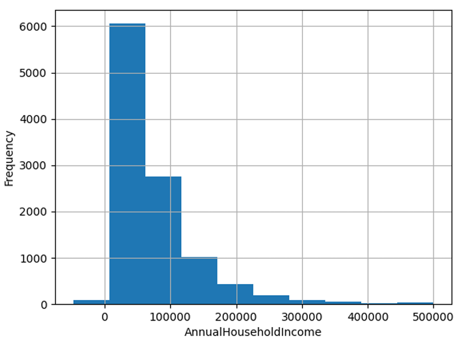
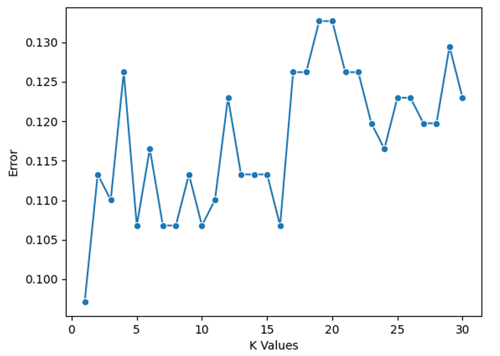
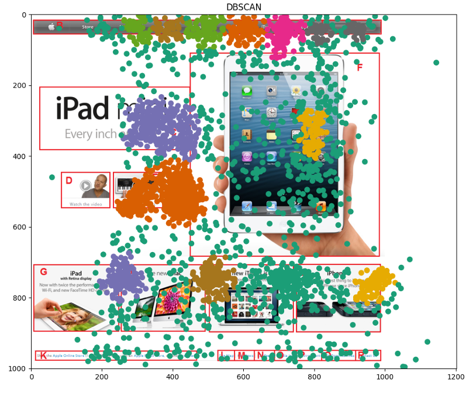

# Applied Data Mining Pipeline for Health & Behavioral Analysis

Developed and evaluated a comprehensive end-to-end data mining pipeline to extract insights from diverse real-world datasets — including COVID-19 survey responses, lung cancer patient data, and user eye-tracking behavior — showcasing full-cycle data analysis, modeling, and interpretation skills.


## 🎯 Project Goal

The objective was to demonstrate practical proficiency across all stages of the data mining lifecycle — data understanding, cleaning, transformation, modeling, and evaluation — using Python and industry-standard libraries.

---

## 📂 Project Pipeline & Modules

This project is divided into four distinct modules, each corresponding to a core task in the data mining pipeline.

### Part 1: Exploratory Data Analysis (EDA) & Preprocessing

* **Task:** Data understanding, cleaning, and transformation of a real-world COVID-19 survey dataset.
* **Script:** `data_analysis.py`
* **Report:** `data_analysis_report.pdf`

**Methodology:**
* **Data Understanding:** Loaded the `cng514-covid-survey-data.csv` dataset and calculated initial statistical metrics (mean, variance, quartiles).
* **Data Cleaning:**
    * **Missing Data:** Handled missing values using techniques like mean/median imputation or row removal.
    * **Noisy Data:** Identified and corrected outliers using binning (equal-width and equal-depth).
* **Data Transformation:**
    * **Feature Scaling:** Applied Min-Max normalization and Z-score standardization to numerical features.
    * **Correlation:** Calculated the Pearson correlation matrix to identify relationships between variables (e.g., `Coronavirus Concern2` vs. `BirthYear2020`).
* **Visualization:** Used histograms and boxplots to visualize data distributions before and after cleaning.


<p style="text-align: center">Example Histogram</p>

---

### Part 2: Classification (Lung Cancer Risk)

* **Task:** Built and evaluated a k-Nearest Neighbors (k-NN) classifier to predict lung cancer risk.
* **Script:** `classification.py`
* **Report:** `classification_report.pdf`

**Methodology:**
* **Model:** Implemented the k-Nearest Neighbors (k-NN) algorithm from scratch.
* **Optimization:** Determined the optimal hyperparameter `k` (number of neighbors) by plotting the "Elbow Method" graph and finding the point of diminishing returns for accuracy.
* **Validation:** Employed **10-fold cross-validation** to ensure the model's performance was robust and not a result of a "lucky" train-test split.
* **Evaluation:** Assessed the best model's performance using a confusion matrix and key metrics:
    * **Accuracy:** Overall correct predictions.
    * **Precision:** Percentage of "at-risk" predictions that were correct.
    * **Recall:** Percentage of actual "at-risk" patients that were correctly identified.
    * **F1-Score:** The harmonic mean of Precision and Recall.



---

### Part 3: Association Rule Mining (Apriori)

* **Task:** Discovered frequent co-occurring patterns in user eye-tracking data (e.g., "which parts of a webpage are viewed together?").
* **Script:** `apriori.py`
* **Report:** `apriori_dbscan_report.pdf`

**Methodology:**
* **Data:** Used the `Apple_sequence_dataset.txt`, where each line represents a sequence of "Areas of Interest" (AOIs) a user looked at.
* **Algorithm:** Implemented the **Apriori** algorithm to efficiently find all itemsets (groups of AOIs) that meet a minimum `support` threshold.
* **Rule Generation:** Generated association rules (e.g., `A -> B`) from the frequent itemsets that met a minimum `confidence` threshold.
* **Analysis:** Evaluated how the number and quality of rules changed by experimenting with different support and confidence values.

---

### Part 4: Clustering (DBSCAN)

* **Task:** Identified "hotspots" or regions of high user engagement on a webpage by clustering raw (x, y) eye-tracking fixation points.
* **Script:** `my_dbscan.py`
* **Report:** `apriori_dbscan_report.pdf`

**Methodology:**
* **Data:** Used the raw (x,y) coordinates from the `Apple_fixation_dataset` (data from 37 participants).
* **Algorithm:** Implemented **DBSCAN** (Density-Based Spatial Clustering of Applications with Noise). This algorithm is ideal for this task as it can find arbitrarily shaped clusters and identify outliers (fixations not part of any main cluster).
* **Tuning:** Experimented with the `epsilon` (neighborhood radius) and `min_samples` (core point density) parameters to find the most meaningful clusters.
* **Visualization:** Plotted the resulting cluster-labeled (x,y) points onto the original `APPLE.png` image to visually validate the discovered Areas of Interest.



## 🚀 How to Run

Each task is contained in its own Python script and can be run independently.

1.  **Clone** the repository.
2.  **Install** required libraries: `numpy`, `pandas`, `scikit-learn`, `matplotlib`.
3.  **Run** the desired analysis script:

```bash
# To run the EDA and preprocessing task
python data_analysis.py

# To run the k-NN classification task
python classification.py

# To run the Apriori association rule mining
python apriori.py

# To run the DBSCAN clustering task
python my_dbscan.py
```